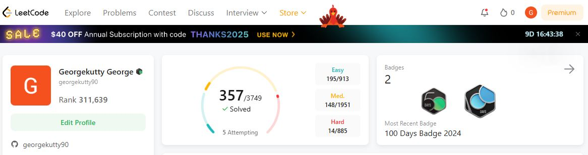

# 👋 Hi, I'm *Georgekutty George*

### 🚀 Full Stack Developer | Lead Engineer | 11+ Years Experience  
📍 Idukki, Kerala, India • 💻 Open to collaboration • 🔍 Passionate about scalable software and cloud-native solutions

---

### 🧑‍💻 About Me
Technology professional with **11+ years of experience** designing and developing **scalable web applications** using  
**.NET 8/6, ASP.NET Core, Microservices, ReactJS, and AWS Cloud**.  
I specialize in **modernizing legacy systems**, **leading engineering teams**, and **leveraging AI tools (GitHub Copilot, Generative AI)** to accelerate delivery.

I enjoy solving complex business problems through **clean architecture**, **modern front-end frameworks**, and **cloud-native engineering**.

---

### 🔧 Tech Expertise

| Category | Technologies |
|---------|--------------|
| Backend | .NET 8/6, ASP.NET Core, Web API, C#, Microservices |
| Frontend | ReactJS, JavaScript, TypeScript, Angular 4, jQuery, HTML, CSS |
| Database | SQL Server, PostgreSQL, DynamoDB |
| DevOps | AWS (Lambda, ECS, S3, Bedrock), Git, Azure DevOps, TeamCity, Harness |
| Testing | Selenium (C#), NUnit, XUnit, Postman |
| Tools & Others | GitHub Copilot, GenAI, DataDog, Docker, Agile (SCRUM, KANBAN) |
| Concepts | SOLID, Dependency Injection, Cloud Migration, PWA |

---

### 📈 LeetCode & Coding Achievements

- 🔥 Solved **300+ algorithmic problems**
- 💡 Consistent **Daily Streak achiever**
- 🏅 **Silver Badge** in Problem Solving
- 💻 Hackerrank certifications in:
  - C# (Basic), Python (Basic), SQL (Basic–Advanced)
  - JavaScript (Basic), React
- 🤖 Active in problem-solving and competitive programming
- 

> _“Love solving real-world challenges through code and logic.”_

---

### 🏆 Certifications

| Certification | Year |
|--------------|------|
| AWS Certified AI Practitioner | 2025 |
| AWS Certified Cloud Practitioner | 2023 |
| Databricks – Generative AI Fundamentals | 2024 |
| MTA: Database Fundamentals | 2021 |
| MTA: Software Development Fundamentals | 2021 |
| HackerRank & TestDome | SQL, C#, JS, .NET Core MVC, React |

---

### 🎓 Qualifications

- 📘 **EPGDM in Project Management** – Alliance University (2022) – *GPA 83.4%*  
- 🎓 **B.Tech in Computer Science** – MG University (2013)  
- 🏫 12th CBSE – *GPA 78.6%* | 10th CBSE – *GPA 87.4%*  

---

### 💼 Professional Experience

💼 **Assistant Consultant – Tata Consultancy Services (2021 – Present)**  
- Migrated legacy apps to **.NET 8 & AWS Cloud**  
- Led team of **5–7 engineers**, mentored and set coding standards  
- Built apps using **ReactJS + .NET Core + PostgreSQL**  
- Leveraged **GitHub Copilot & GenAI for productivity optimization**

💼 **Associate Tech Lead – Suyati Technologies (2017 – 2021)**  
- Designed **ReactJS + .NET Core microservices architecture**  
- Delivered cloud-native and PWA solutions  
- Led engineering team & ensured technical excellence

💼 **Senior Software Engineer – Zerone Consulting (2013 – 2017)**  
- Built enterprise apps using **ASP.NET, Angular, MVC, Dapper**  
- Implemented design patterns, DevOps, and CI/CD integration

---

### 📊 GitHub & Dev Stats

---

### 💬 Let's Connect

🔗 **GitHub:** https://github.com/georgekutty90  
🔗 **LinkedIn:** https://www.linkedin.com/in/georgekutty-george-b88a4398/  
📧 **Email:** georgekutty90@gmail.com  
📱 **Phone:** +91 96334 04628  

---

### 🛠 Fun Fact  
> I turn business problems into brilliantly engineered software solutions – faster with AI.

🌟 _If you like what you see, feel free to connect or collaborate!_  
